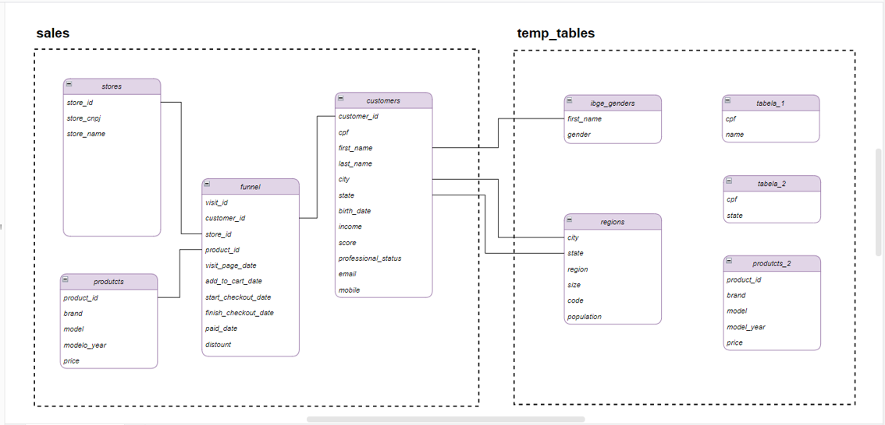

# SQL para Análise de Dados

Este repositório reúne minhas anotações e exercícios desenvolvidos durante o curso **SQL para Análise de Dados: Do básico ao avançado**, utilizando PostgreSQL.

O objetivo é registrar minha evolução nos estudos e praticar a aplicação de SQL na consulta, organização e análise de dados.

## Sobre o curso

- **Curso:** SQL para Análise de Dados: Do básico ao avançado
- **Instrutora:** Midori Toyota
- **Plataforma:** Udemy
- **Link:** [Acessar o curso](https://www.udemy.com/course/sql-para-analise-de-dados/)

## Conteúdos

### Módulo 1 — Fundamentos de SQL

- Estrutura básica de uma consulta;
- `SELECT`;
- `DISTINCT`;
- `WHERE`;
- `ORDER BY`;
- `LIMIT`;
- Tratamento de valores `NULL`;
- Filtros com datas;
- Exercícios práticos.

### Módulo 2 — Operadores

- Operadores aritméticos;
- Criação de colunas calculadas;
- Concatenação de textos;
- Operadores de comparação;
- Operadores lógicos;
- `AND`, `OR` e `NOT`;
- `BETWEEN`;
- `IN`;
- `LIKE` e `ILIKE`;
- `IS NULL`;
- Exercícios práticos.

### Módulo 3 — Funções Agregadas

- Funções de agregação;
- `COUNT`;
- `SUM`;
- `AVG`;
- `MIN` e `MAX`;
- Agrupamento de resultados com `GROUP BY`;
- Filtros de agrupamentos com `HAVING`;
- Exercícios práticos.

### Módulo 4 — Joins

- Combinação de dados de diferentes tabelas;
- `INNER JOIN`;
- `LEFT JOIN`;
- `RIGHT JOIN`;
- `FULL JOIN`;
- Junções utilizando mais de uma coluna;
- Exercícios práticos.

### Módulo 5 — Unions

- União dos resultados de consultas;
- `UNION`;
- `UNION ALL`;
- Diferenças no tratamento de registros duplicados;
- Compatibilidade entre as colunas das consultas;
- Exemplos práticos.

### Módulo 6 — Subqueries

- Consultas inseridas em outras consultas;
- Subqueries no `WHERE`;
- Organização de consultas com `WITH` e CTEs;
- Subqueries no `FROM`;
- Subqueries no `SELECT`;
- Exemplos e exercícios práticos.

### Módulo 7 — Tratamento de Dados

- Conversão de tipos de dados;
- Tratamento de textos;
- Tratamento de datas;
- Tratamento de valores nulos;
- Criação de condições com `CASE WHEN`;
- Exemplos práticos.

### Módulo 8 — Manipulação de Tabelas

- Criação e exclusão de tabelas;
- Inserção de registros;
- Atualização de registros;
- Exclusão de registros;
- Adição, alteração e remoção de colunas;
- Exemplos práticos.

## Organização do repositório

| Pasta | Conteúdo |
|---|---|
| `Módulo 1 - Fundamentos` | Estrutura e comandos básicos das consultas |
| `Módulo 2 - Operadores` | Operadores aritméticos, de comparação e lógicos |
| `Módulo 3 - Funções Agregadas` | Agregações, agrupamentos e filtros |
| `Módulo 4 - Joins` | Combinação de dados de diferentes tabelas |
| `Módulo 5 - Unions` | União dos resultados de consultas |
| `Módulo 6 - Subqueries` | Subconsultas e CTEs |
| `Módulo 7 - Tratamento de Dados` | Transformação e tratamento dos dados |
| `Módulo 8 - Manipulação de Tabelas` | Manipulação de tabelas, colunas e registros |
| `imagens` | Diagrama da estrutura do banco de dados |

Dentro das pastas dos módulos, os arquivos seguem o padrão:

- `anotacoes.sql`: conceitos e exemplos estudados durante as aulas;
- `exercicios-resolvidos.sql`: exercícios propostos e minhas soluções, quando houver.

## Tecnologias utilizadas

- **SQL:** linguagem utilizada nas consultas e na manipulação dos dados;
- **PostgreSQL:** sistema de gerenciamento do banco de dados;
- **pgAdmin:** ferramenta utilizada para acessar o banco e executar as consultas.

## Banco de dados

As atividades utilizam uma base disponibilizada no curso, com dados de clientes, veículos, lojas e etapas do processo de compra.

A estrutura está organizada em dois schemas: `sales` e `temp_tables`. Os schemas agrupam as tabelas dentro do banco de dados.

### Diagrama da estrutura

O diagrama apresenta as tabelas e as relações utilizadas nos exemplos e exercícios. A tabela auxiliar `temp_tables.duplicados` também faz parte do script do curso, mas não está representada na imagem.

### Schema `sales`

Reúne as tabelas relacionadas às visitas e às vendas de veículos.

| Tabela | Descrição | Chave primária |
|---|---|---|
| `customers` | Dados dos clientes, como nome, localização, nascimento, renda e status profissional | `customer_id` |
| `products` | Dados dos veículos, como marca, modelo, ano e preço | `product_id` |
| `stores` | Identificação das lojas, com nome e CNPJ | `store_id` |
| `funnel` | Registros de visitas e etapas da compra, incluindo carrinho, checkout, pagamento e desconto | `visit_id` |

### Schema `temp_tables`

Reúne tabelas auxiliares utilizadas nas atividades.

| Tabela | Finalidade |
|---|---|
| `ibge_genders` | Associação entre primeiro nome e gênero utilizada nos exercícios |
| `regions` | Informações de municípios, estados, regiões, porte e população |
| `products_2` | Dados adicionais de veículos utilizados nos exemplos de `UNION` e `UNION ALL` |
| `tabela_1` | Dados de CPF e nome utilizados nos exemplos de joins |
| `tabela_2` | Dados de CPF e estado utilizados nos exemplos de joins |
| `duplicados` | Registros utilizados nos estudos de duplicidade |

Apesar do nome `temp_tables`, suas tabelas são criadas como tabelas comuns, e não como tabelas temporárias do PostgreSQL.

### Relacionamentos utilizados

| Tabelas | Colunas utilizadas na junção |
|---|---|
| `sales.funnel` e `sales.customers` | `customer_id` |
| `sales.funnel` e `sales.products` | `product_id` |
| `sales.funnel` e `sales.stores` | `store_id` |
| `sales.customers` e `temp_tables.ibge_genders` | `first_name` |
| `sales.customers` e `temp_tables.regions` | `city` e `state` |
| `temp_tables.tabela_1` e `temp_tables.tabela_2` | `cpf` |

Essas associações são realizadas nas consultas por meio de joins. O script disponibilizado define chaves primárias, mas não declara restrições de chave estrangeira (`FOREIGN KEY`).

### Acesso à base

A base e o script de criação e preenchimento das tabelas são disponibilizados nos materiais do curso e não estão incluídos neste repositório.

O script cria os schemas e as tabelas dentro de um banco já existente. O nome desse banco pode ser definido no ambiente local de estudos.

## Como utilizar

1. Tenha o PostgreSQL instalado e um banco criado para os estudos;
2. Conecte-se a esse banco pelo pgAdmin;
3. Execute o script disponibilizado no curso para criar e preencher as tabelas;
4. Abra a pasta do módulo que deseja consultar;
5. Leia os comentários do arquivo de anotações ou exercícios;
6. Selecione e execute uma consulta por vez.

Os arquivos de estudo estão organizados por trechos, sem ponto e vírgula entre as consultas.

Nos exemplos de manipulação de tabelas, observe a ordem das operações, pois alguns comandos dependem de estruturas criadas anteriormente.

**Atenção:** o script de preparação da base contém comandos `DROP TABLE`. Executá-lo novamente remove e recria as tabelas indicadas, substituindo os dados e alterações anteriores.

## Projetos práticos

Os projetos do curso possuem repositórios próprios, com as consultas, os resultados e a documentação de cada análise.

### Projeto 1 — Dashboard de Acompanhamento de Vendas

**Concluído.**

Projeto desenvolvido com PostgreSQL e Microsoft Excel para acompanhar:

- Receita e ticket médio;
- Volume de visitas e vendas;
- Conversão mensal;
- Vendas por estado;
- Marcas e lojas com mais vendas;
- Visitas por dia da semana.

[Acessar o repositório do projeto](https://github.com/mclarafl/dashboard-acompanhamento-vendas)

### Projeto 2 — Análise de Perfil dos Clientes

**Ainda não iniciado.**

O link será adicionado após a publicação do projeto.

## Progresso

- [x] Módulo 1 — Fundamentos de SQL
- [x] Módulo 2 — Operadores
- [x] Módulo 3 — Funções Agregadas
- [x] Módulo 4 — Joins
- [x] Módulo 5 — Unions
- [x] Módulo 6 — Subqueries
- [x] Módulo 7 — Tratamento de Dados
- [x] Módulo 8 — Manipulação de Tabelas
- [x] Projeto 1 — Dashboard de Acompanhamento de Vendas
- [ ] Projeto 2 — Análise de Perfil dos Clientes

## Autora

**Maria Clara Ferreira Lima**

[GitHub](https://github.com/mclarafl) · [LinkedIn](https://www.linkedin.com/in/mariacfl/)

> Repositório criado para registrar meus aprendizados e acompanhar minha evolução em SQL e análise de dados.
